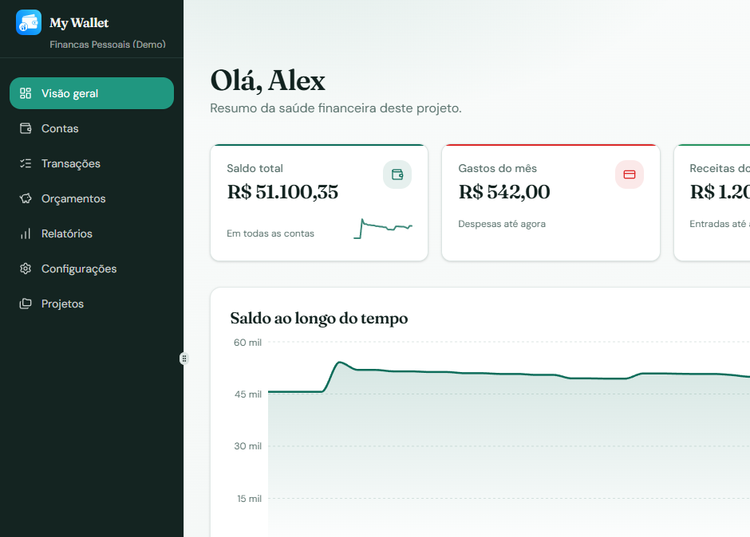

# My Wallet

Aplicação frontend de gestão financeira pessoal, pensada como **portfólio / demo**: sem backend, sem banco remoto. Os dados ficam no **localStorage** do navegador, organizados em **projetos** isolados.



## Visão geral

- Landing de produto com CTA para demo e projetos
- Hub para criar, editar, abrir e excluir projetos (CRUD completo)
- Projeto **demo** padrão com contas, transações e orçamentos de exemplo
- Dashboard por projeto: visão geral, contas, transações, orçamentos, relatórios e configurações
- Temas curados (Atelier, Noite, Menta, Crepúsculo, Âmbar, Mono)
- Persistência 100% local (localStorage)
- Deploy automático no **GitHub Pages**

## Stack

- React 19 + Vite 8 + TypeScript
- Tailwind CSS 4 + Shadcn UI
- Zustand (estado + persistência local)
- React Router 7, next-themes
- Recharts, React Hook Form, Zod

## Começar localmente

```bash
npm install
npm run dev
```

Abra `http://localhost:5173`. Na primeira visita um projeto demo é criado automaticamente.

```bash
npm run build      # gera dist/
npm run preview    # pré-visualiza o build
npm run lint
npm run typecheck
npm run test
npm run ci         # lint + typecheck + test + build
```

Para simular o base path do GitHub Pages:

```bash
VITE_BASE_PATH=/MyWallet/ npm run build
VITE_BASE_PATH=/MyWallet/ npm run preview
```

## Rotas

| Path | Página |
|------|--------|
| `/` | Landing |
| `/projetos` | Hub de projetos |
| `/project/:projectId` | Overview |
| `…/accounts`, `…/transactions`, `…/budgets`, `…/reports`, `…/settings` | Dashboard |

## GitHub Pages

O workflow [`.github/workflows/deploy-pages.yml`](.github/workflows/deploy-pages.yml) roda em todo push na `main`: primeiro os quality gates ([`.github/workflows/ci.yml`](.github/workflows/ci.yml)), depois build e publish.

1. No repositório GitHub: **Settings → Pages → Build and deployment → Source: GitHub Actions**
2. Após o primeiro deploy bem-sucedido, a app fica em:  
   `https://guilhermeroesler.github.io/MyWallet/`

O build usa `VITE_BASE_PATH=/MyWallet/` (nome do repositório no GitHub) e copia `index.html` → `404.html` para o fallback de rotas SPA.

## Modelo de dados (localStorage)

Chave: `my-wallet:projects`

Cada projeto contém:

- metadados (`name`, `description`, `isDemo`, timestamps)
- `settings` (nome, moeda, tema, preferências)
- `accounts`, `transactions`, `budgets`

O dashboard (overview, spent dos orçamentos, gráficos) é **calculado no cliente** a partir desses dados.

## Estrutura

- `src/pages/LandingPage.tsx` — landing de produto
- `src/pages/ProjectsPage.tsx` — hub de projetos
- `src/store/projectStore.ts` — CRUD de projetos
- `src/store/dashboardStore.ts` — CRUD financeiro do projeto ativo
- `src/lib/demo-data.ts` — seed do projeto demo
- `src/lib/compute.ts` — agregações do dashboard
- `src/lib/format.ts` — formatação PT-BR / BRL
- `src/lib/themes.ts` — registro dos temas curados

## Licença

Projeto de demonstração e portfólio.
